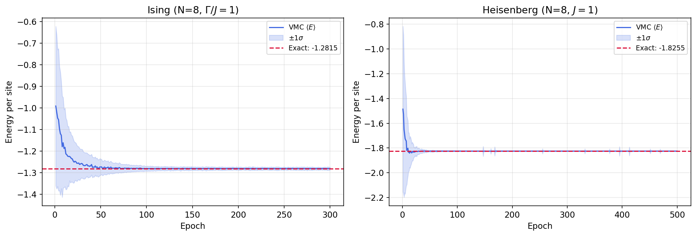
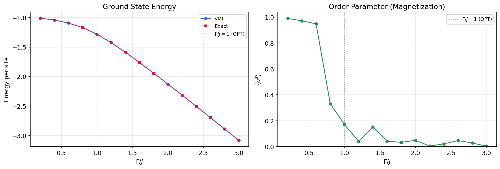
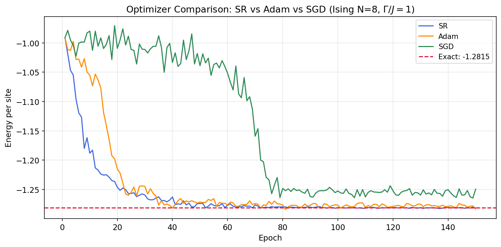
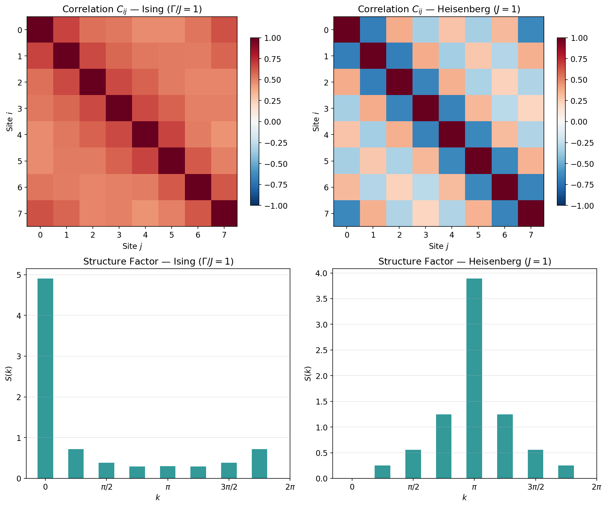

# Neural Quantum States

**Using neural networks to solve problems in quantum physics that are too large to solve exactly.**

A quantum system with N particles has 2^N possible states — even 40 particles would require more memory than exists on Earth to store. Instead of brute-forcing the full solution, this project trains a neural network to learn a compact representation of it. The network is optimized using Monte Carlo sampling and a physics-based loss function (energy minimization), with no training data needed — just the laws of quantum mechanics. The result: the neural network finds the correct answer to **< 0.01% error**, verified against exact solutions.

**Technical details:** The neural network is a Restricted Boltzmann Machine (RBM) used as a variational ansatz for quantum ground state wavefunctions. It is optimized via Variational Monte Carlo (VMC) with Stochastic Reconfiguration (a natural gradient method that uses the quantum geometric tensor). Tested on two 1D quantum spin models — the Transverse Field Ising Model and the Heisenberg XXX Model — and verified against exact diagonalization. Implements the method from [Carleo & Troyer, *Science* 355, 602 (2017)](https://doi.org/10.1126/science.aag2302).

| System | VMC Energy | Exact Energy | Error |
|--------|-----------|-------------|-------|
| Ising (N=8, Γ/J=1) | -8.2413 | -8.2425 | 0.011% |
| Heisenberg (N=8, J=1) | -14.6033 | -14.6044 | 0.007% |

## Key Results

### Energy Convergence
The RBM converges to the exact ground state energy within a few hundred training epochs:

<p align="center">
  
</p>

### Quantum Phase Transition
Scanning the transverse field strength Γ/J reveals the quantum phase transition at Γ/J = 1:

<p align="center">
  
</p>

### Optimizer Comparison
Stochastic Reconfiguration (natural gradient for quantum states) dramatically outperforms standard optimizers:

<p align="center">
  
</p>

### Physical Observables
Correlation matrices and structure factors capture the spatial structure of quantum entanglement:

<p align="center">
  
</p>

## How It Works

1. **Ansatz:** An RBM parameterizes the wavefunction ψ(σ) over spin configurations σ ∈ {±1}^N
2. **Sampling:** Metropolis-Hastings MCMC draws configurations from |ψ(σ)|²
3. **Energy:** Local energies E_loc(σ) = ⟨σ|H|ψ⟩/⟨σ|ψ⟩ are computed for each sample
4. **Gradient:** The VMC gradient uses the log-derivative trick: ∇E = 2 Re[⟨O* E_loc⟩ - ⟨O*⟩⟨E_loc⟩]
5. **Update:** Stochastic Reconfiguration solves (S + εI)δθ = -η∇E, where S is the quantum geometric tensor

The variational principle guarantees ⟨E⟩ ≥ E_ground, so minimizing the energy finds the ground state.

## Quick Start

```bash
# Clone and install
git clone https://github.com/yourusername/neural-quantum-states.git
cd neural-quantum-states
pip install numpy scipy matplotlib tqdm pyyaml

# Run the Ising model
python scripts/run_vmc.py configs/ising_small.yaml

# Run the Heisenberg model
python scripts/run_vmc.py configs/heisenberg.yaml

# Generate the phase diagram (~5 min)
python scripts/plot_phase_diagram.py

# Run tests
python -m pytest tests/ -v
```

## Project Structure

```
neural-quantum-states/
├── src/
│   ├── hamiltonians/          # Quantum Hamiltonians
│   │   ├── base.py            # Abstract base class
│   │   ├── ising.py           # Transverse Field Ising Model
│   │   └── heisenberg.py      # Heisenberg XXX Model (with Marshall sign rule)
│   ├── ansatz/                # Neural network wavefunctions
│   │   ├── base.py            # Abstract base class
│   │   └── rbm.py             # Restricted Boltzmann Machine
│   ├── sampler.py             # Metropolis-Hastings MCMC (single flip + exchange moves)
│   ├── optimizer.py           # Stochastic Reconfiguration, Adam, SGD
│   ├── trainer.py             # VMC training loop
│   ├── observables.py         # Magnetization, correlations, structure factor
│   ├── exact.py               # Exact diagonalization (scipy sparse Lanczos)
│   └── utils.py               # Logging, checkpointing, plotting, config loading
├── configs/                   # YAML experiment configs
├── scripts/                   # CLI entry points
├── notebooks/
│   └── demo.ipynb             # Interactive walkthrough with all visualizations
└── tests/                     # 64 unit tests
```

## Physics

**Transverse Field Ising Model:**
H = -J Σᵢ σᵢᶻσᵢ₊₁ᶻ - Γ Σᵢ σᵢˣ

Undergoes a quantum phase transition at Γ/J = 1 from an ordered (ferromagnetic) phase to a disordered (paramagnetic) phase. The magnetization |⟨σᶻ⟩| serves as the order parameter.

**Heisenberg XXX Model:**
H = J Σᵢ **S**ᵢ · **S**ᵢ₊₁

The antiferromagnetic ground state has a non-trivial sign structure (Marshall sign rule) that we handle analytically, allowing the real-valued RBM to represent the full quantum ground state.

## Design Highlights

- **Abstract base classes** for Hamiltonians and ansätze — adding a new model requires implementing just one method (`local_energy` or `log_psi`)
- **YAML config system** — every hyperparameter is recorded for reproducibility
- **Three optimizers** (SR, Adam, SGD) with a common interface for fair comparison
- **Exchange MCMC moves** for Heisenberg — conserves total Sz, essential for sampling in the correct symmetry sector
- **Gradient + delta clipping** with chain rescue — prevents wavefunction collapse during training
- **64 unit tests** covering Hamiltonians, RBM, sampler, and observables

## References

- G. Carleo and M. Troyer, "Solving the Quantum Many-Body Problem with Artificial Neural Networks," *Science* **355**, 602 (2017). [doi:10.1126/science.aag2302](https://doi.org/10.1126/science.aag2302)
- S. Sorella, "Green Function Monte Carlo with Stochastic Reconfiguration," *Phys. Rev. Lett.* **80**, 4558 (1998).
- W. Marshall, "Antiferromagnetism," *Proc. R. Soc. Lond. A* **232**, 48 (1955).
